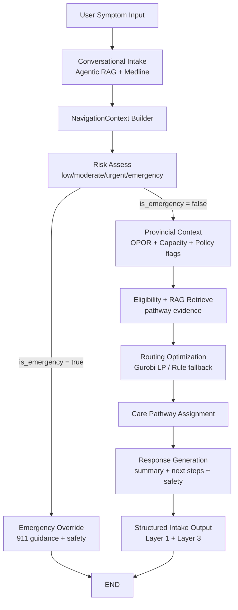

# 07 — Dev-Accurate Node Flow Diagram

Purpose: a visual-spec artifact that mirrors runtime behavior in `script.js` and current backend contract (`POST /assess`).

## A. Canonical flow (presentation-safe)

## B. Runtime data objects per node

- `A/B -> C`: `text`, `region`, optional `opor_context`
- `C`: `intake_summary`
- `D`: `risk_assessment` (`score`, `level`, `emergency_flags`)
- `F`: `provincial_context` (capacity snapshot, available pathways, policy flags)
- `G/H`: `pathway_eligibility`, `rag_context`, optimization inputs (`w_p`, `t_p`, `c_p`, `e_p`)
- `I`: `routing_recommendation` / `routing_result`
- `J/K`: `structured_summary`, UI `response` schema

## C. Current deployed backend contract (today)

From OpenAPI at `http://127.0.0.1:8000/openapi.json`:

- endpoint: `POST /assess`
- request: `AssessRequest { text, region, opor_context? }`
- response: `AssessResponse {
  session_id,
  patient_input,
  risk_assessment,
  opor_context?,
  provincial_context?,
  routing_recommendation,
  system_context,
  structured_summary,
  governance
}`

## D. UI mapping currently used

`script.js` maps backend response to panel schema via `mapAssessResponseToPanel()`:

- `routing_recommendation.reason` -> `navigation_summary`
- `routing_recommendation.primary_pathway` -> first patient next-step
- `structured_summary.symptoms|duration|risk` -> `information_to_prepare`
- `governance.confidence_score` -> `confidence.numeric_score`

## E. Visual labels to use (exact wording)

- "Conversational Intake (Agentic RAG + Medline)"
- "NavigationContext Builder"
- "Provincial Context (OPOR + Capacity + Policy)"
- "Optimization Routing (Gurobi LP)"
- "Structured Intake Output"

## F. Do-not-drift rules for diagrams

- Never place "Linear Programming" before conversational intake/context builder.
- Emergency branch must bypass optimization and go directly to safety output.
- If showing Solution 2 overlays, present them as analytics derived from Solution 1 routing traces (not as first-pass patient routing).

Status: v1.0 (dev-accurate to current code/specs)
